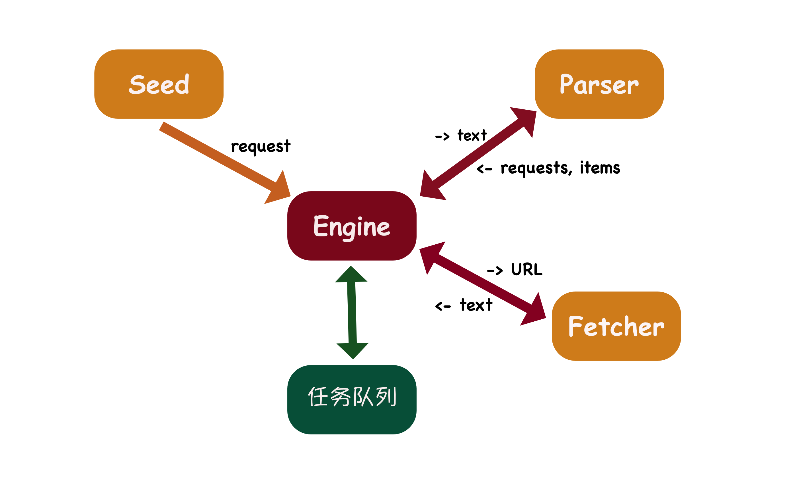
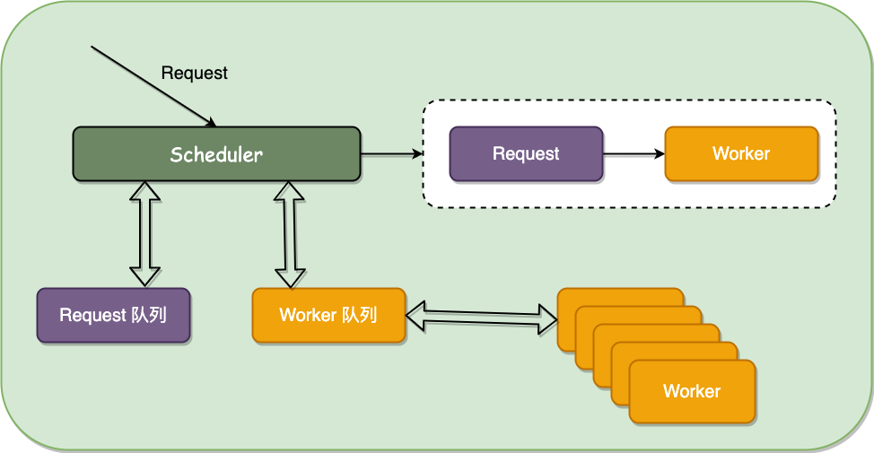

# 爬虫

## 单机版爬虫架构

从 Seed 中送入 request 给 Engine，Engine 会把所有的 request 加入任务队列，针对每个任务队列中的任务去调用 Fetcher，并等待
Fetcher 的返回。
单任务版慢的原因也在此处，就是必须等待每一个 Fetcher 的返回。
等待返回之后，将 Fetcher 返回的文本送给 Parser，再等待 Parser 的返回，并将 Parser 返回的
requests 加入任务队列，把返回的 items 打印出来。

## 并发版爬虫架构

🙀【单机版 ⟹ 并发版改动点】

* 将 Engine 中调用 Fetch 和 Parser 的部分提取出来，形成 worker

### Scheduler 实现 II：并发分发 Request

### Scheduler 实现 III：Request 队列和 Worker 队列

