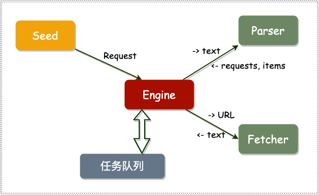
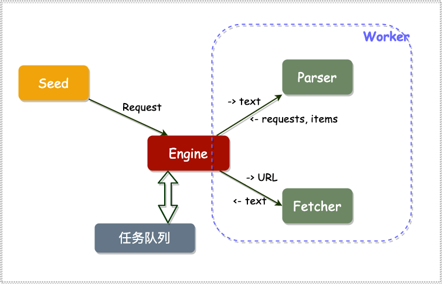
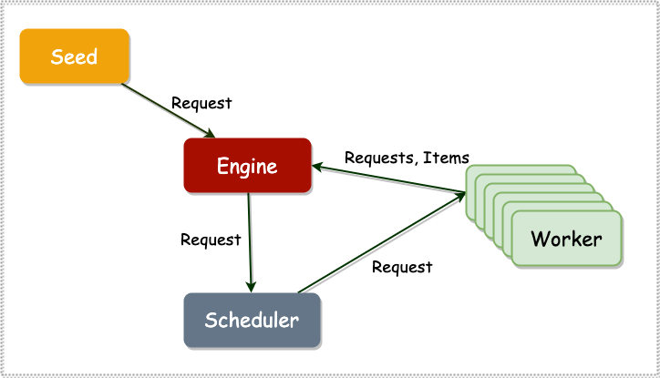
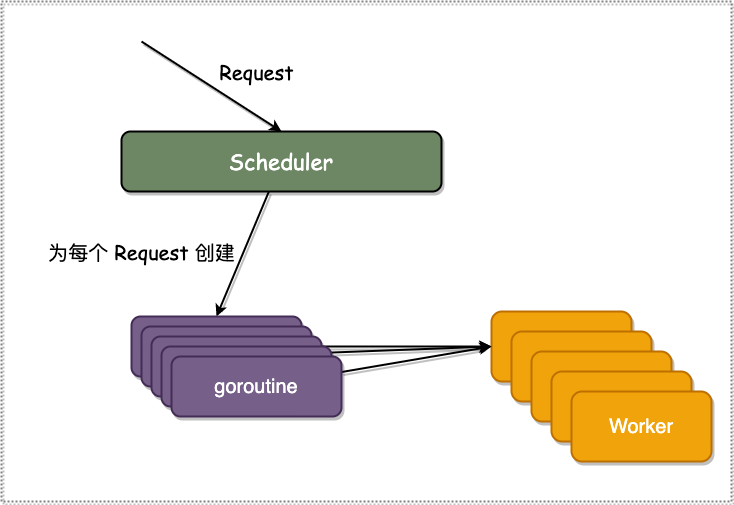
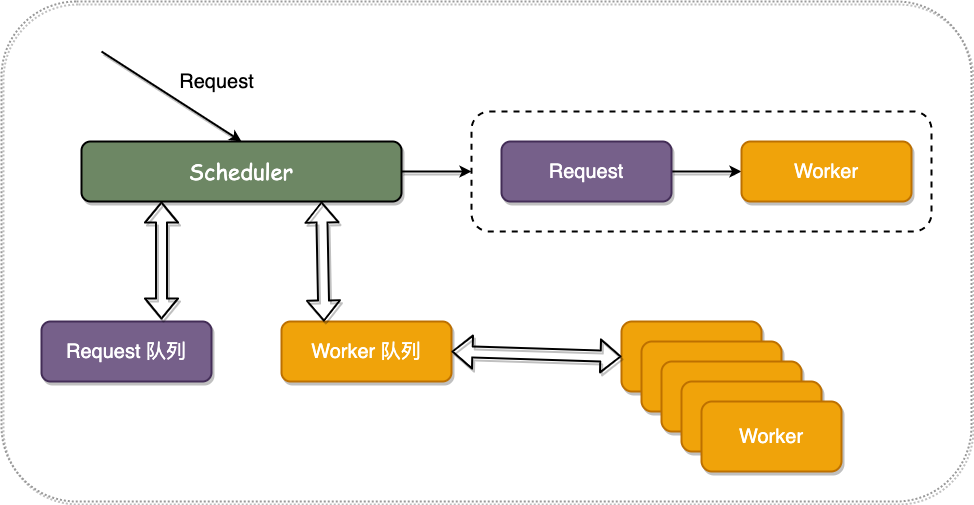
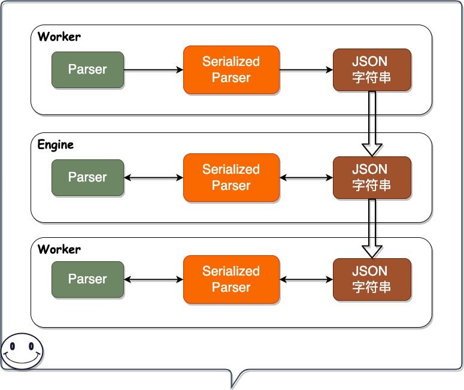

# 🕸 爬虫

## 单机版爬虫架构

从 Seed 中送入 request 给 Engine，Engine 会把所有的 request 加入任务队列，针对每个任务队列中的任务去调用 Fetcher，并等待
Fetcher 的返回。
单任务版慢的原因也在此处，就是必须等待每一个 Fetcher 的返回。
等待返回之后，将 Fetcher 返回的文本送给 Parser，再等待 Parser 的返回，并将 Parser 返回的
requests 加入任务队列，把返回的 items 打印出来。

## 并发版爬虫架构

### 单机版 ⟹ 并发版改动点

🍑 将 Engine 中调用 Fetch 和 Parser 的部分提取出来，形成 worker

该 worker 的输入为 Request，输出为 Requests 和 Items，Engine 会将收到的 Items 打印到控制台上，将 Request 送入 Scheduler 中。

### Scheduler 实现

#### 实现 I

🌀 **所有 Worker 公用一个输入**

> 🤔 那这样实现有什么缺点呢？

scheduler 将任务分发到 work chan 中，多个 worker 从 worker chan 中拿 request 进行处理，处理完成的结果包含两部分：

* 一部分是 item，也就是我们需要的用户信息，现在对其处理的方式是直接打印在控制台上
* 另一部分是包含在结果中的 request，该 request 会继续被 scheduler 分发到 work chan 中进行处理

出现了【循环等待】的问题：worker 等待 scheduler 分发其处理结果中包含的 request，而 scheduler 等待 worker 接收其分发的任务

> 🤔 那如何解决呢？

为每个 request 创建一个 go routine，每个 go routine 只做一件事，就是将 request 分发到 worker chan 这一操作，也就是下面的
Scheduler 实现版本 II。

#### 实现 II

🌀 **并发分发 Request**

#### 实现 III

🌀 **Request 队列和 Worker 队列**

实现 II 的缺点在于可控性差，也就是能人为控制的地方比较少，因此 实现III 诞生了。

在实现 III 中，Request 和 Worker 各自有一个队列，当同时有 Request 又有 Worker 在排队的情况下，便可以将 Request 分发给
Worker。这种方式实现的爬虫性能与 实现II 基本相同。

## URL 去重

> 为解决数据重复问题，现需要对 URL 进行去重。可采用的方案如下。

🫧 **哈希表**

哈希表是最简单的一种去重方式，缺点是存放 URL 的话占据空间过大，可能会造成内存不足。并且重启重续后，之前保存的 URL 会丢失。

🫧 **计算 MD5 等哈希，再存哈希表**

第二种就是先计算 URL 的 MD5，然后再将计算结果存入哈希表中，这样可解决直接存放 URL 导致的占用空间过大的问题。缺点是每个 URL
都需要计算其 MD5 的值，时间效率会降低。

🫧 **使用 Bloom Filter 多重哈希结构**

可以使用 Bloom Filter 这种多重的哈希结构来更快更有效的对 URL 进行去重。

🫧 **使用 Redis 等 Key-Value 存储系统实现分布式去重**

当 URL 过多，内存存不下的时候，可以改为使用数据库存储。

## 分布式架构

### 解析器序列化流程

